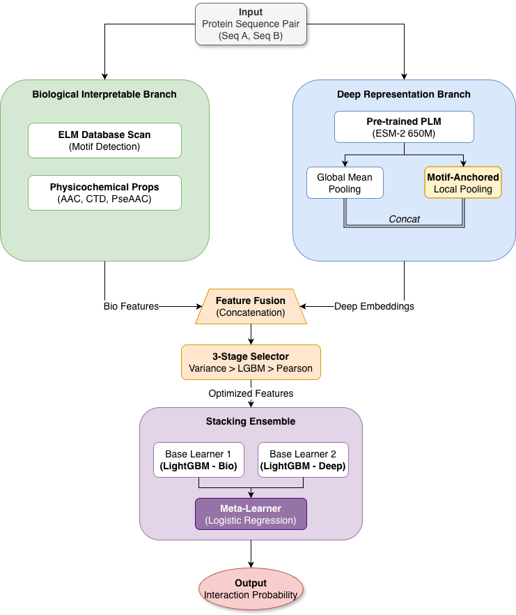

# HybridStack-PPI: A Biologically-Informed Hybrid Stacking Framework

[](LICENSE)
[](https://www.python.org/)
[](https://pytorch.org/)
[]()

> **Abstract:** Recent Protein Language Models (PLMs) like ESM-2 have revolutionized PPI prediction but often lack interpretability. **HybridStack-PPI** bridges this gap by systematically integrating deep semantic embeddings with explicit evolutionary motifs (SLiMs). Validated on Human and Yeast datasets under strict protein-level splitting, our framework achieves **99.45% accuracy** while maintaining biological transparency.

<p align="center">
  
  <br>
  <em>Figure 1: The dual-branch architecture of HybridStack-PPI.</em>
</p>

## 🚀 Key Features

- **Biologically-Informed:** Explicitly utilizes SLiMs (Short Linear Motifs) from the ELM database combined with deep learning.
- **High Accuracy:** Achieves **99.45%** accuracy on the Human BioGRID dataset via a rigorous Protein-level split protocol to prevent leakage.
- **Hybrid Architecture:** A dual-branch system merging ESM-2 embeddings with physicochemical priors via a novel "motif-anchored" pooling strategy.
- **Reproducible:** Deterministic results with fixed random seeds and protein-level cross-validation.

## ⚙️ System Requirements

- **OS:** Linux or macOS recommended (Windows supported via WSL2).
- **Python:** 3.9+.
- **Hardware:**
  - **GPU:** CUDA-compatible GPU with at least **8GB VRAM** is recommended for ESM-2 (650M) inference.
  - **RAM:** 16GB+ system memory.
  - **Disk Space:** ~3GB for model weights and dataset cache.

## 🛠️ Installation

1. **Clone the repository:**

   ```bash
   git clone https://github.com/mxuanvan02/HybridStackPPI.git
   cd HybridStackPPI
   ```

2. **Install dependencies:**
   ```bash
   pip install -r requirements.txt
   ```

## 📂 Data Preparation

### 1. BioGRID Datasets

Due to GitHub file size limits, the processed `.tsv` files might not be included in the repo.

- Ensure the `data/BioGrid/Human` and `data/BioGrid/Yeast` directories contain the required `human_pairs.tsv` and `yeast_pairs.tsv` files.
- If missing, please run the preprocessing script or download the dataset from [Insert Link to Data Source].

### 2. ELM Motifs Database

The model automatically fetches motif definitions from the ELM database (http://elm.eu.org/elms/elms_index.tsv).

> **Note:** An active internet connection is required for the first run to download and cache this database to `data/resources/`.

## 📊 Reproducing Results

To reproduce the benchmark results reported in the paper (Table 3 & Table 4):

```bash
# Run 5-fold CV on Human dataset
python scripts/reproduce_results.py --dataset human --n-splits 5

# Run 5-fold CV on Yeast dataset
python scripts/reproduce_results.py --dataset yeast --n-splits 5
```

## 🧪 Usage (Prediction)

To predict the interaction probability between two arbitrary protein sequences using the trained model:

```bash
python scripts/predict.py \
  --seq1 "MEEPQSDPSVEPPLSQETFSDLWKLLP..." \
  --seq2 "MCNTNMSVPTDGAVTTSQIPASEQET..."
```

## 📂 Project Structure

```
HybridStackPPI/
├── hybridstack/          # Core Python package
│   ├── __init__.py
│   ├── feature_engine.py # Feature extraction (ESM-2 + Bio-priors)
│   ├── builders.py       # Model pipeline builders
│   ├── selectors.py      # Feature selection logic
│   ├── metrics.py        # Evaluation metrics
│   └── data_utils.py     # Data loading utilities
├── scripts/              # Experiments & Utility scripts
│   ├── run.py            # Main experiment runner
│   ├── predict.py        # Inference script
│   └── reproduce_results.py
├── data/                 # Processed datasets (Human/Yeast)
├── models/               # Saved model weights
├── docs/                 # Documentation & Images
└── requirements.txt
```

<!-- ## 📝 Citation

If you find HybridStack-PPI useful for your research, please cite our paper:

```bibtex
@article{mai2025hybridstack,
  title={A Biologically-Informed Hybrid Stacking Framework for Protein-Protein Interaction Prediction},
  author={Mai, Xuan Van and Dang, Tri Nguyen and Nguyen, Ngoc Thanh and Nguyen, Tuong Tri},
  journal={Computer Science and Information Systems},
  year={2025},
  note={Under Review}
}
``` -->

## 📄 License

This project is licensed under the MIT License - see the [LICENSE](LICENSE) file for details.
